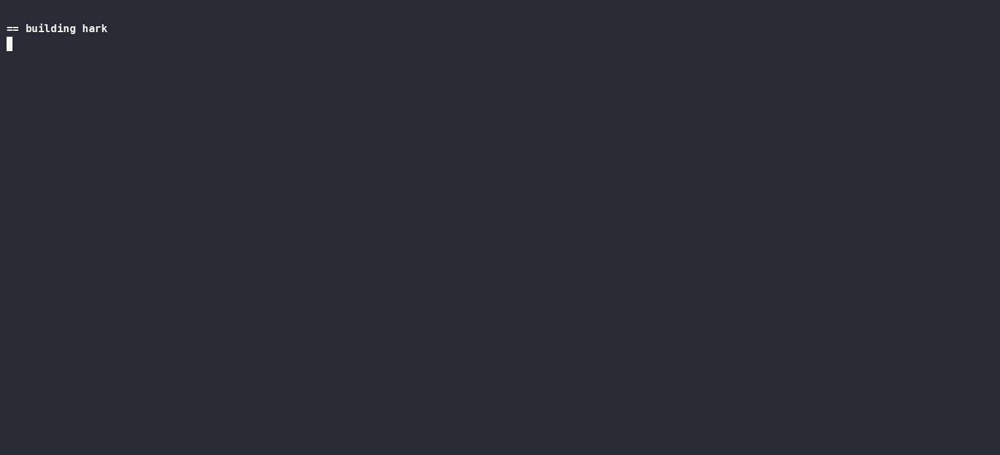

# hark

Deterministic record and replay for AI agents — with a proof the replay is real.

[](docs/fidelity.md)

Static and hand-updated alongside [docs/fidelity.md](docs/fidelity.md), not CI-generated —
see that page for what 25/25 does and does not claim.

**Status: v0.1.** Recording, replay, forking, transparency anchoring and the static trace report are
implemented, tested, and verified end to end on Linux — a run has been anchored in the public
Sigstore log and its inclusion checked from a second machine. See
[docs/roadmap.md](docs/roadmap.md).

Linux only. `hark` depends on network namespaces, Landlock and seccomp; there is no Windows or macOS
port planned.



---

## What this is

An agent runtime where the component that *contains* the agent is the same component that *records*
it, and the recording is externally verifiable.

That sentence is the whole design. Containment and recording happen at one boundary, so a single
artifact is simultaneously the security record and a sufficient input to re-derive the run. A
transparency-log commitment over that artifact is what makes it evidence rather than a log file.

```text
hark run -policy demo.toml -- python agent.py     → run-01J8X.hark
hark replay run-01J8X.hark                        → REPLAY-EQUAL, 22 actions
hark fork -at 47 -patch strip-injection.json ...  → provably identical prefix, live suffix
hark verify run-01J8X.hark                        → signature + transparency inclusion OK
hark report run-01J8X.hark                        → one self-contained HTML file
```

Three properties, none of which is useful without the other two:

1. **Deterministic replay.** Every LLM call, tool result, clock read, RNG draw and blocked egress
   attempt is recorded at the RPC boundary. A past run replays on another machine and produces the
   same sequence of actions, or names the first one where it diverged. The comparison is a digest
   over normalised actions rather than the Merkle root, and
   [the build log explains why the root could never work](docs/build-log.md).
2. **Kernel-enforced containment.** The agent runs in its own network namespace with no route except
   through the mediator, a Landlock-scoped filesystem, seccomp and no capabilities. Enforcement is
   out-of-process: a prompt-injected agent cannot switch it off.
3. **Tamper-evident audit.** A hash chain for streaming integrity, a Merkle Mountain Range for
   O(log n) inclusion proofs, an Ed25519 signed tree head, anchored in a public transparency log.

The agent cannot write to its own audit log, cannot reach the network except through the recorder,
and cannot see the credentials it uses.

## Why the third property is not optional

An operator-signed hash chain proves nothing against the operator. They can discard a run, rewrite
its events, re-sign the result, and present it as the only run that ever happened. Signatures give
integrity against third parties, never against the log's author.

Non-equivocation needs a witness the operator does not control. That is why `hark verify` reports
the transparency anchor as a separate line rather than folding it into one boolean, and why an
unanchored bundle says so in plain words:

```text
transparency  not anchored -- integrity only, no non-equivocation
```

The reasoning is in [ADR-0004](docs/decisions/0004-transparency-log-over-operator-signed-receipts.md).

## What "deterministic" does and does not claim

> Determinism is a property of the harness, not the model. Given the same recorded external inputs,
> the agent produces the same sequence of externally-visible actions and the same log root. We do
> not — and cannot — claim the model would re-emit the same tokens.

Temperature-0 inference is not reproducible on hosted endpoints: server-side batch size changes the
numerical path through the kernels, so identical requests diverge. `hark` does not control the
serving stack, so it records what the model said rather than pretending it could re-derive it.

Overclaiming here is the most common flaw in this category of tool, and it is the first thing a
reviewer should check.

## The incident

The demo is the shortest way to see what the artifact is for. Linux and root, because the containment
is real; no API key, no cost and no network, because the upstream is a stub that
[says so](demo/README.md).

```sh
sudo ./demo/run.sh
```

A naive agent fetches a briefing, asks a model to summarise it, and carries out the plan it gets
back. The briefing carries an injected instruction. The model follows it. The plan says to post the
API key to `evil.example`, and the agent — which has no reason to distrust a plan it asked for — does
exactly that:

```text
16  EgressAttempt    evil.example:443 (tcp)
17  EgressDecision   DENIED evil.example by allow_hosts: host not in the policy allowlist
```

That is the control people expect. The second is the one worth staying for: the value it tried to
leak was `hark-placeholder-01J8X-api_key`. The real credential is substituted at the boundary, for
allowed hosts only, so it was never in the agent's address space to lose. **Two independent controls,
neither of which the agent could switch off, both visible in the same artifact.**

Then the artifact earns its name, and the whole loop above takes about a second:

```sh
hark verify  incident.hark      # chain, root, signature, transparency anchor
hark replay  incident.hark      # re-runs the agent against the recording. dials nothing
hark fork -at N -patch strip-injection.json incident.hark
hark report  incident.hark      # one HTML file, opens with the network off
```

The fork is the interesting one. It re-executes the run up to the page fetch, checking every action
against the recording as it goes, removes the injected paragraph, and goes live from there. The
model — a live call this time — returns a summary, and nothing tries to leave the namespace. The
counterfactual is answered with a run rather than an argument:

```text
FORKED  provably identical prefix, live suffix
  parent root  19b3ed6ada2790ac91af1f4de360f926753cc8ece4fc9e112f2924dad6de16f2
  branch at    event 11, after 11 verified actions
  patch        strip the injected instruction from the fetched briefing
```

Never bit-exact. Everything after the branch point is a fresh run, and the output says so —
[ADR-0008](docs/decisions/0008-forks-have-a-verified-prefix-and-a-live-suffix.md).

## What it costs

Measured on a 2 vCPU shared Azure instance; method and full tables in
[docs/benchmarking.md](docs/benchmarking.md), and no number appears here that is not produced by a
command written down there.

| | |
| --- | --- |
| Mediation, versus dialling the same stub directly | **+0.18 ms** at p50, +0.28 ms at p99 |
| Replaying a run that waited 0.9 s on its model call | **1052 ms → 145 ms** |
| Verifying a 100,000-event bundle | 276 ms, 188 MB/s |
| Proving one event happened | 448 bytes, 14 hashes |
| A bundle, per 1,000 events | 518 KB raw, 79 KB gzipped |

The replay figure is the one to read carefully. Replay saves exactly the upstream latency it does not
wait for, so the ratio is a property of the recording rather than of hark: an agent making thirty
model calls saves thirty times as much. What is constant is the floor — **a replay costs what
starting the agent costs**, around 145 ms of namespace setup and interpreter start, and almost
nothing else.

## Quickstart

Requires Go 1.23+.

```sh
go build ./cmd/hark

./hark keygen -out hark.key             # Ed25519 signing key
./hark synth -key hark.key run.hark     # synthetic bundle: a prompt-injection incident
./hark inspect run.hark                 # list the events
./hark verify run.hark                  # check chain, root, signature
./hark prove -seq 14 -out proof.json run.hark
./hark prove -check proof.json          # verify one event without the bundle
```

`synth` fabricates a bundle so the format and verifier can be exercised before the recorder exists.
It is a test fixture with a CLI, and the bundles it writes say so in their `RunStart`.

To watch the verifier catch things:

```sh
./hark synth -corrupt 9 bad.hark      && ./hark verify bad.hark      # BROKEN, names the event
./hark synth -truncate 14 part.hark   && ./hark verify part.hark     # TRUNCATED, keeps the prefix
./hark verify -key <wrong-hex> run.hark                              # REJECTED
```

Exit codes: `0` verified, `1` broken or rejected, `3` truncated. A killed run is a real state rather
than a failure, so it gets its own code.

## Why inclusion proofs

Proving that one event happened costs a few hundred bytes and log₂(N) hashes. Shipping the bundle
could cost hundreds of megabytes, and would disclose the entire run to whoever you are trying to
convince about one line of it.

```text
$ ./hark prove -seq 14 run.hark        # the egress denial, out of 17 events
  4 sibling hashes + 1 peak            # ~300 bytes
```

## Layout

```text
cmd/hark/            CLI
internal/hashchain/  domain-separated BLAKE3 primitives
internal/logfmt/     event kinds, canonical CBOR payloads, frame codec
internal/mmr/        Merkle Mountain Range, inclusion proofs
internal/signer/     Ed25519 signed tree heads
internal/bundle/     .hark reader, writer, verifier
internal/runid/      ULID run identifiers
internal/policy/     the run allowlist, exact matches only
internal/launcher/   netns, veth, Landlock, seccomp, capability drop
internal/mediator/   DNS, TLS termination, SNI, egress policy, forwarding, playback
internal/broker/     placeholder credentials, substituted at the boundary
internal/reqkey/     canonical request identity, for matching a replayed request
internal/replay/     indexes a recording, and reduces a run to its comparable actions
internal/fork/       the branch-point gate, and the patch applied at it
internal/rekor/      transparency-log submission and inclusion checking
internal/report/     the self-contained HTML trace
internal/shim/       supervisor side of the clock and RNG capture channel
shim/                the Python side, injected via PYTHONPATH
demo/                the prompt-injection incident
```

## Documentation

|   |   |
| --- | --- |
| [docs/architecture.md](docs/architecture.md) | Trust zones, packages, recording flow, concurrency model |
| [docs/protocol.md](docs/protocol.md) | Wire format. The authority — code follows this |
| [docs/security.md](docs/security.md) | Threat model, controls, and the known limitations |
| [docs/decisions/](docs/decisions/) | ADRs. Read before proposing a change one of them settled |
| [docs/build/](docs/build/) | **Implementation specs, one per phase — the working documents** |
| [docs/roadmap.md](docs/roadmap.md) | What ships when, and what is deliberately out of scope |
| [docs/testing.md](docs/testing.md) | Strategy, and what is deliberately not tested |
| [docs/benchmarking.md](docs/benchmarking.md) | Methodology, written before any number is published |
| [demo/README.md](demo/README.md) | The incident, what it shows, and what the stub does and does not establish |
| [docs/build-log.md](docs/build-log.md) | Session-by-session narrative of what was built and why |
| [docs/glossary.md](docs/glossary.md) | Terms that mean one specific thing here |

Also: [api](docs/api.md) · [data model](docs/data-model.md) · [runbook](docs/runbook.md) ·
[observability](docs/observability.md) · [troubleshooting](docs/troubleshooting.md)

## Related work

Checked against each project's own repository and documentation in August 2026, not against a
summary. Where a row is uncomfortable for `hark`, it says so: overstating the gap would be a worse
outcome than having a smaller one.

| Project | What it actually does | Where `hark` differs |
| --- | --- | --- |
| [Pipelock](https://github.com/luckyPipewrench/pipelock) | An agent firewall with the same containment primitives — Landlock, seccomp, network namespaces — that scans mediated HTTP/MCP/A2A traffic, emits Ed25519-signed action receipts over a hash-chained evidence log, and can anchor receipt checkpoints in Rekor | **The nearest neighbour by a distance.** The artifact is forensic rather than re-executable: it records what was decided, not enough to re-derive the run. No replay, no fork |
| [Clawker](https://github.com/schmitthub/clawker) | Runs coding agents in Docker containers behind a deny-by-default egress firewall, self-hosted | Container isolation and egress control, no recording of the traffic as a verifiable artifact |
| [nono](https://github.com/nolabs-ai/nono) | Kernel-enforced capability sandbox — Landlock on Linux, Seatbelt on macOS — wrapping any agent process with no daemon or container | Containment only; produces no run artifact |
| [AgentSight](https://github.com/eunomia-bpf/agentsight) | eBPF observability: intercepts TLS to recover LLM traffic and correlates it with kernel events, zero instrumentation, <3% overhead ([paper](https://arxiv.org/abs/2508.02736)) | Observes without enforcing, and does not produce a replayable recording. Its eBPF approach is what `hark` defers past v0.1 — [ADR-0003](docs/decisions/0003-network-namespaces-not-ebpf-for-v0.1.md) |
| [Agent VCR](https://github.com/Jarvis2021/agent-vcr) | Records MCP JSON-RPC sessions into `.vcr` cassettes and replays them deterministically in CI, cross-language between Python and TypeScript | Genuinely deterministic replay, at the MCP layer, for testing. No containment, no tamper-evidence, and the recording is a test fixture rather than evidence |
| [mcpsnoop](https://github.com/kerlenton/mcpsnoop) | Transparent stdio proxy showing every MCP frame live, with a `check` command to gate a run on protocol errors | Debugging visibility, not enforcement or replay |
| [LangSmith](https://smith.langchain.com), [Braintrust](https://www.braintrust.dev), [Arize Phoenix](https://arize.com) | Trace and evaluate LLM applications: nested spans, cost and latency, LLM-as-judge scoring, regression datasets | Observation and judgement of runs the application reports. `hark` is the runtime the agent runs inside, and its record is taken at a boundary the agent cannot bypass |
| [Temporal](https://docs.temporal.io/encyclopedia/event-history) | Durable execution: an event history per workflow, re-executed deterministically after failure, with a command mismatch detected as non-determinism | The same core idea, applied to workflows rather than agents, with no security model and no cryptographic audit. `hark` borrows the shape and adds containment and proofs |

Two honest conclusions from doing this properly. **Containment is a crowded field and `hark` should never be introduced as a sandbox** — Pipelock in particular reaches the same kernel primitives and signs its evidence. And **deterministic replay already exists at the MCP layer**, in Agent VCR, done well.

What no project in this table does is produce one artifact that is simultaneously the enforcement record and a sufficient input to re-execute the run, with a fork that can prove which part of a counterfactual is the original run. That intersection is the whole of `hark`'s claim, and it is a narrower claim than "agent sandbox with an audit log".

## Maintainer

**DevGurav** — [github.com/DevGurav](https://github.com/DevGurav)

## Licence

[Apache 2.0](LICENSE) — the prevailing choice for Go infrastructure (Kubernetes, Docker, Temporal,
Cilium), and its explicit patent grant matters more than permissiveness for anything an enterprise
might adopt.
